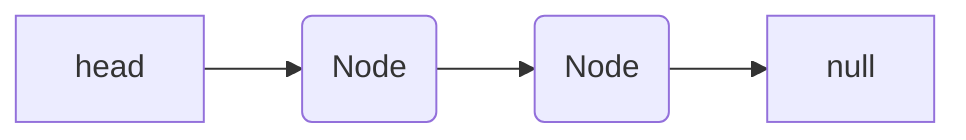

# trainLinkList-

## Problem Domain

You have a train. You have to add up all the passengers on the train, but you do not know how long the train is.

## EXAMPLE DATA

You start at the front of the train.

## Visual

## Train 



```mermaid
graph LR
head --> A(Node)'LINK'-->B(Node)
B-->C[null]
```

## Algorithm

1. You start at front of the Train (Head)
2. You count all the passengers on the train and store total count.
3. Then go to the door (link) check if door is unlocked if unlocked then go through (next).
4. Count all passengers on train and store in new store total and add store total.
5. Then go to the door (link) check if door is unlocked. If door is not unlocked. Then your at the end of train.
6. Then return store total amount of passengers on train.

## Pseudocode

## Code

## Big O

Time: O(n)
Space: O(n)