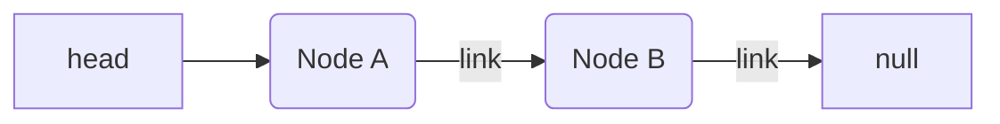
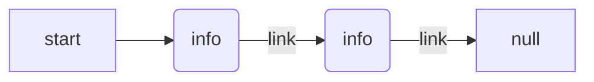
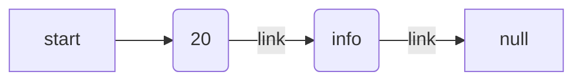
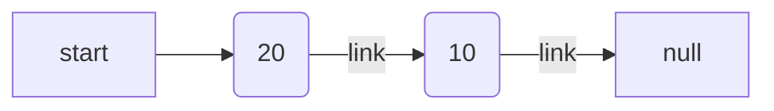

# trainLinkList-

## Problem Domain

You have a train. You have to add up all the passengers on the train, but you do not know how long the train is.

## EXAMPLE DATA

You start at the front of the train.

## Visual

## Train

## Node A

- count Passengers say there is 20
- need to store 20
- node data = 20
- check if there is next
- if there is a next then move to next else if no next stop
- there is a next

## Node B

- count Passengers say there is 10
- need to store 10
- node data = 10
- then you need to add the two node data to get the sum.
- Then store the sum
- check if there is next
- if there is a next then move to next else if there is no next stop
- there is no next
- stop and return the sum

## Output: 30

## Algorithm

1. You start at front of the Train (Head)
2. You count all the passengers on the train and store total count.
3. Then go to the door (link) check if door is unlocked if unlocked then go through (next).
4. Count all passengers on train and store in new store total and add store total.
5. Then go to the door (link) check if door is unlocked. If door is not unlocked. Then your at the end of train.
6. Then return store total amount of passengers on train.

## Pseudocode

1. Set the value of the pointer (ptr) to the head of the linked list and a sum variable with 0.
2. Traversing the linked list using a loop until all the nodes get traversed.
    - Add the value of current node to the sum. sum += ptr -> data .
    - Increment the pointer to the next node of linked list. ptr = ptr ->next .
3. Return the sum.

- node of the Linked List
- let head;
- create Link list node
- class Node {
  constructor() {
    this.data = 0;
    this.next = null;
  }
}
- function to insert a node at the beginning
- function push(headRef, newData) {
  - assign node
  - let newNode = to new Node();
    - put in the data
    - newNode.data = newData;
      - link the old node list to the new node
      - newNode.next = headRef;
        - move the the point to the new node
        - headRef = newNode;
        - return head = headRef;
}

- create a function to find the sum of nodes
  - function sumOfNodes(head) {
    - let ptr = head;
      - let sum = 0;
        - while (ptr != null) {
          sum += ptr.data;
           ptr = ptr.next;
        }
  
    - return sum;
    }

## Code

## Big O

- Time: O(n)
- Space: O(1)
